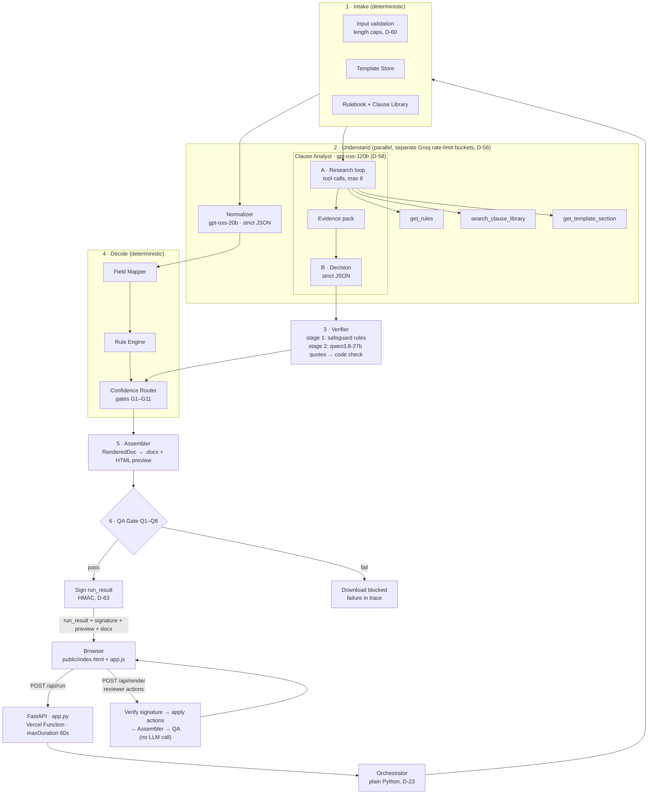

# Zycus Contract Authoring Agent

An AI agent system that drafts a Mutual NDA from a template and business inputs — fills in what it's confident about, and flags anything missing, ambiguous, or non-standard for a human to decide. Built for the Zycus Product Intern (AI PM Track) take-home, Track A.

🚀 **Live Production URL:** [https://zycus-blond.vercel.app](https://zycus-blond.vercel.app)

---

## What It Does

> **"Code for correctness, LLM for judgment."**  
> Rules, not the AI, decide what is safe. Anything that shifts legal risk always routes to a human, and a deterministic QA gate guarantees no raw placeholders, unformatted dates, or unauthorized commercial terms ever reach the final document.

An autonomous AI agent system that drafts a Mutual Non-Disclosure Agreement (NDA) from a standard template and raw business inputs. It deterministically fills standard terms, resolves relative dates, flags missing or ambiguous inputs, performs a two-phase tool research loop to assess non-standard clause requests against an approved library, validates required legal safeguards, enforces zero-token human-in-the-loop (HITL) review via HMAC-SHA256 signed envelopes, and compiles pixel-faithful `.docx` documents.

---

## System Architecture



---

## Confidence & Human-in-the-Loop (HITL) Logic

1. **Deterministic Rule Supremacy (Gates G1–G11)**: Legal validity and readiness statuses are decided strictly by deterministic rule gates, never by self-reported model confidence.
2. **Confidence Can Only Downgrade**: If an LLM is uncertain (confidence `< high` or duration cross-check mismatch), Gate G8 / G9 downgrades the term to `NEEDS_REVIEW`. Model confidence can never bypass a rule.
3. **Risk-Shifting Belongs to Humans (Gate G5)**: Any non-standard special clause (such as affiliate disclosures or carve-outs) is routed to `NEEDS_REVIEW`. The AI gathers evidence and proposes fallback wording; the human reviewer makes the binding call.
4. **Four Reviewer Actions with Safeguard Warnings**: In the UI, the reviewer can select **Accept proposed fallback**, **Use as requested**, **Remove clause**, or **Edit text**. Editing text without mandatory safeguards triggers an immediate warning banner.
5. **Zero-Token Stateless Envelope Verification**: Every run output is sealed with an HMAC-SHA256 signature envelope. Reviewer actions are executed in `POST /api/render` with 0 new LLM calls and sub-50ms latency.

---

## Model Allocation

| Component | Provider | Model ID | Role & Rationale |
|---|---|---|---|
| **Intake Normalizer** | Groq | `openai/gpt-oss-20b` | Structured field parsing (e.g. "2 yrs from signing" → 24 months, "use today's date" → derived) via strict JSON schema. Fast and token-efficient. |
| **Clause Analyst** | Groq | `openai/gpt-oss-120b` | Two-phase assessment: Phase A conducts an agentic tool loop (max 6 calls) over rulebook and clause library; Phase B renders strict structured decision. |
| **Verifier** | Groq | `qwen/qwen3.8-27b` | Adversarial second-opinion verification validating that proposed texts contain mandatory safeguards (e.g., recipient liability, need-to-know restrictions). |
| **Standby Fallback** | Google / OpenAI compat | `gemini-3.5-flash` | Conditional fallback activated only if Groq encounters sustained 429 quota exhaustion (D-69). |

---

## Evaluation Results (Live Production)

Live evaluations executed across all 14 test scenarios on Groq models with dynamic rate-limit pacing:

- **Overall Pass Rate**: **14/14 (100.0%)**
- **Must-Pass Pass Rate**: **6/6 (100.0%)**
- **Evaluation Matrix Report**: [`evals/results/latest.md`](evals/results/latest.md)

| ID | Title | Must-Pass | Expected Status | Actual Status | Result | Latency | Tokens Consumed |
|---|---|---|---|---|---|---|---|
| **S01** | Provided sample (Zycus / Northwind Mutual NDA) | **Yes** | `NEEDS_REVIEW` | `NEEDS_REVIEW` | ✅ PASS | 6.9s | 3,168 tokens |
| **S02** | Governing law left empty | **Yes** | `BLOCKED` | `BLOCKED` | ✅ PASS | 8.0s | 3,392 tokens |
| **S03** | Term of 10 years (outside standard range) | No | `NEEDS_REVIEW` | `NEEDS_REVIEW` | ✅ PASS | 7.4s | 3,453 tokens |
| **S04** | Term expressed as an ambiguous condition, not a duration | No | `NEEDS_REVIEW` | `NEEDS_REVIEW` | ✅ PASS | 5.3s | 3,379 tokens |
| **S05** | Payment terms supplied on an NDA | **Yes** | `NEEDS_REVIEW` | `NEEDS_REVIEW` | ✅ PASS | 11.7s | 3,504 tokens |
| **S06** | No special clause requested | **Yes** | `READY_FOR_SIGNATURE_REVIEW` | `READY_FOR_SIGNATURE_REVIEW` | ✅ PASS | 1.3s | 1,480 tokens |
| **S07** | Special clause with no library match (residual knowledge carve-out) | No | `NEEDS_REVIEW` | `NEEDS_REVIEW` | ✅ PASS | 6.6s | 3,176 tokens |
| **S08** | Special clause attempts a prompt injection | **Yes** | `NEEDS_REVIEW` | `NEEDS_REVIEW` | ✅ PASS | 11.0s | 3,073 tokens |
| **S09** | Receiving party name has no legal entity designator | No | `NEEDS_REVIEW` | `NEEDS_REVIEW` | ✅ PASS | 6.8s | 3,160 tokens |
| **S10** | Both parties identical, and neither is a Zycus entity | No | `BLOCKED` | `BLOCKED` | ✅ PASS | 7.7s | 3,381 tokens |
| **S11** | Effective date given explicitly, not derived | No | `NEEDS_REVIEW` | `NEEDS_REVIEW` | ✅ PASS | 54.1s | 1,496 tokens |
| **S12** | Survival period stated as perpetual | No | `NEEDS_REVIEW` | `NEEDS_REVIEW` | ✅ PASS | 76.7s | 1,490 tokens |
| **S13** | Governing law not on the approved list (Singapore) | No | `NEEDS_REVIEW` | `NEEDS_REVIEW` | ✅ PASS | 1.0s | 1,438 tokens |
| **S14** | AI unavailable — safe degraded draft | **Yes** | `NEEDS_REVIEW` | `NEEDS_REVIEW` | ✅ PASS | 0.0s | 0 tokens (fallback) |

---

## Environment Variables

Configure these in `.env` locally (copied from `.env.example`) or in Vercel Project Settings:

- `GROQ_API_KEY` — Groq API authentication key.
- `RUN_SIGNING_SECRET` — HMAC-SHA256 signing secret for stateless HITL envelopes (≥32 bytes hex).
- `APP_TIMEZONE` — Timezone for effective date resolution and audit timestamps (e.g. `Asia/Kolkata`).
- `MODEL_NORMALIZER` — Model ID for field intake normalization (default `openai/gpt-oss-20b`).
- `MODEL_ANALYST` — Model ID for two-phase clause assessment tool loop (default `openai/gpt-oss-120b`).
- `MODEL_VERIFIER` — Model ID for clause safeguard verification (default `qwen/qwen3.8-27b`).
- `MODEL_FALLBACK` — Fallback model ID (default `gemini-3.5-flash`).
- `PARALLEL` — Run intake normalization and clause analysis concurrently (`true`/`false`).
- `LLM_MODE` — Execution mode (`live` for Groq API, `fake` for offline testing).
- `SERVE_STATIC` — Serve `public/` directory via FastAPI locally (`true`/`false`).
- `GEMINI_API_KEY` — Optional Gemini API key for cross-provider fallback.
- `ENABLE_FALLBACK` — Enable Gemini fallback on Groq rate limits (`true`/`false`).
- `FORCE_AI_FAILURE` — Force fallback degraded path for outage demonstrations (`true`/`false`).

---

## Run Locally

```bash
# 1. Clone & create virtual environment
git clone https://github.com/Flukeshotz/Zycus.git
cd Zycus
python3.12 -m venv .venv
source .venv/bin/activate

# 2. Install dependencies
pip install -r requirements-dev.txt

# 3. Configure environment
cp .env.example .env
# Edit .env and set your GROQ_API_KEY and RUN_SIGNING_SECRET

# 4. Verify API connectivity and spike checks
python scripts/sdk_smoke.py

# 5. Run test suite
pytest

# 6. Launch local dev server
SERVE_STATIC=true uvicorn app:app --reload --env-file .env --port 8000
```

Open <http://127.0.0.1:8000/> in your browser.

---

## Live Fallback (ngrok)

If Vercel experiences cloud platform downtime during review:

```bash
source .venv/bin/activate
SERVE_STATIC=true LLM_MODE=live uvicorn app:app --port 8000 &
ngrok http 8000
```
Share the generated `https://<id>.ngrok-free.app` URL as the live demonstration fallback.

---

## Documentation Links

- [docs/architecture.md](docs/architecture.md): Complete architecture specification, component boundaries, and gate order.
- [docs/decision.md](docs/decision.md): Complete record of architectural decisions (D-01 to D-69) and spike results.
- [docs/implementation.md](docs/implementation.md): Phase-by-phase implementation tracker and exit gates.
- [docs/DEBUG_LOG.md](docs/DEBUG_LOG.md): Running diary of real runtime bugs hit during build and how they were fixed.
- [docs/AI_MISTAKES.md](docs/AI_MISTAKES.md): Build-time AI coding mistakes caught and corrected.

---

## Limitations

1. **Groq Free-Tier Rate Limits**: Free tier allows 8,000 TPM per model bucket. Sequential eval runs require pacing (`--pace`) to avoid temporary 429 throttling.
2. **Template Scope**: Currently configured for Mutual NDAs (Delaware law standard). Additional contract templates can be added to `data/templates/`.
3. **Illustrative Rulebook**: Standard positions (2-year term, 3-year survival, Delaware/NY/California jurisdiction) are illustrative and configurable via `data/rulebook/nda_rules.yaml`.

---

## Not Legal Advice

This application is an engineering demonstration built for evaluation purposes. Generated documents and assessments are drafts for human legal review, not legal advice.
