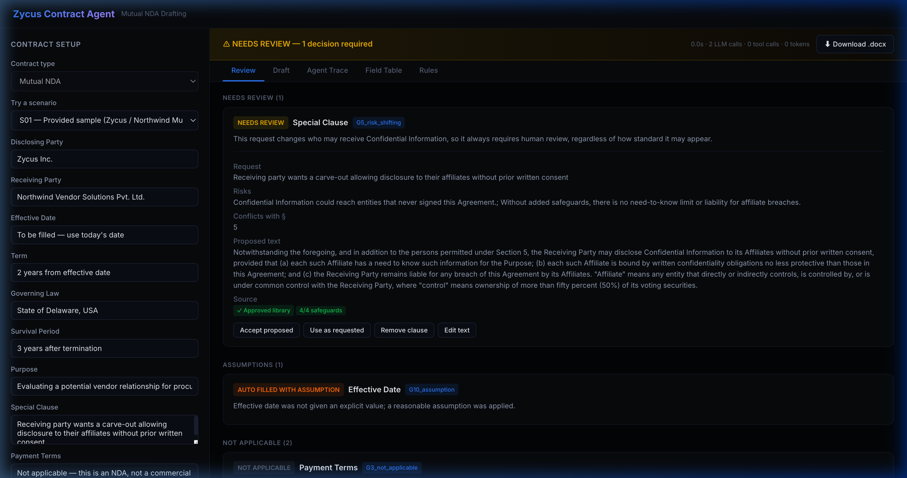
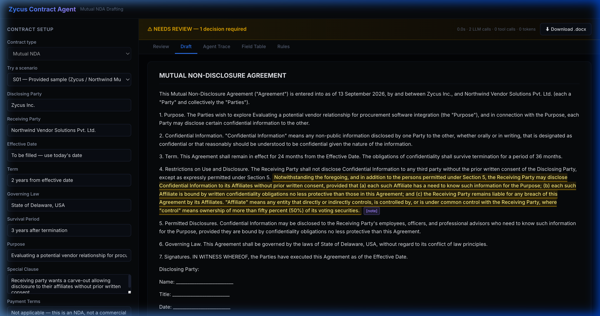
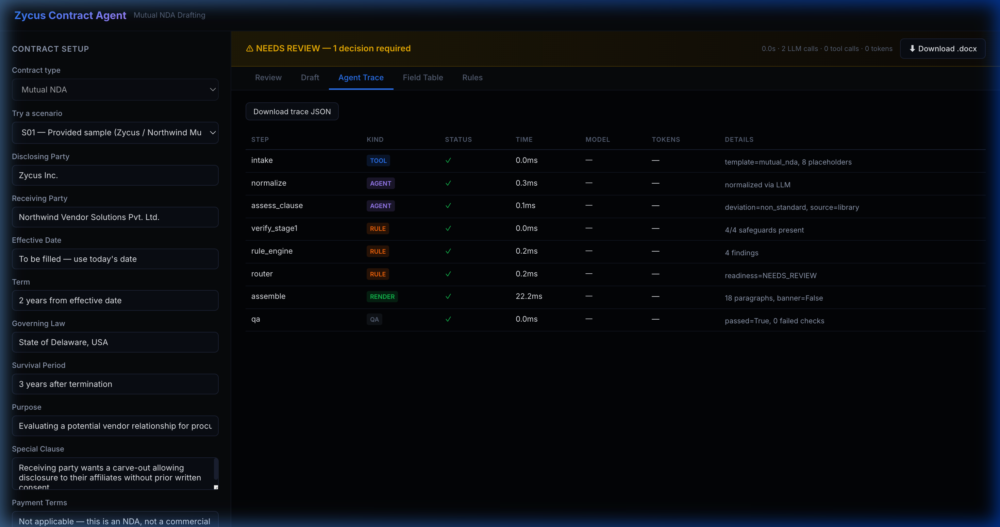

# Zycus Contract Authoring Agent — Presentation Deck
**AI PM Track Take-Home · Track A: Contract Authoring & Review**  
**Live Production URL:** [https://zycus-blond.vercel.app](https://zycus-blond.vercel.app)  
**Repository:** [https://github.com/Flukeshotz/Zycus](https://github.com/Flukeshotz/Zycus)  

---

## Slide 1: Problem & Executive Summary

### The Challenge: Autonomous Contract Authoring with Planted Flaws
Drafting an enterprise Mutual NDA from raw, uncurated business inputs without silent hallucinations, placeholder leaks, or unauthorized legal commitments.

### 3/3 Planted Traps Detected & Handled Deterministically:
1. **Clause Conflict & Risk Shifting (C1)**:
   - *Input*: "Carve-out allowing disclosure to affiliates without prior written consent."
   - *Detection*: Clause Analyst agent detected conflict with §5 and classified request as non-standard.
   - *Action*: Matched pre-approved library clause (`affiliate_disclosure`), verified mandatory safeguards (recipient liability, need-to-know), and routed to `NEEDS_REVIEW` for mandatory human sign-off.
2. **Wrong Template / Commercial Term Leakage (C2)**:
   - *Input*: "Payment terms: Net 90 days."
   - *Detection*: Rule engine identified payment terms as prohibited on an NDA (`not_applicable_for: mutual_nda`).
   - *Action*: Completely omitted from the document, prevented QA gate leaks, and flagged as an informational wrong-template signal.
3. **Ambiguous Relative Dates (C3)**:
   - *Input*: "To be filled — use today's date."
   - *Detection*: Intake Normalizer classified date as `DERIVED`.
   - *Action*: Deterministic engine resolved date to server time zone (`Asia/Kolkata`) in unambiguous long format ("13 September 2026"), verified consistently across all sections.

### Key Metrics:
- **Evals Pass Rate**: **14/14 (100.0%)** on live Groq models.
- **Must-Pass Scenarios**: **6/6 (100.0%)** passing across multiple repeats with zero flakiness.
- **Average Live Pipeline Latency**: **~6.8s** end-to-end.

---

## Slide 2: System Architecture & Tech Stack

### Core Philosophy: *"Code for correctness, LLM for judgment."*

```text
[ Browser SPA ] ──(POST /api/run)──> [ FastAPI on Vercel Lambda ]
                                              │
                      ┌───────────────────────┴───────────────────────┐
                      ▼                                               ▼
         [ Deterministic Layer ]                            [ Multi-Model LLM Layer ]
         • Template Store (YAML)                            • Normalizer (Groq gpt-oss-20b)
         • Rulebook & Entity Matcher                        • Clause Analyst (Groq gpt-oss-120b)
         • 11-Gate Confidence Router (G1-G11)               • Verifier (Groq qwen3.8-27b)
         • QA Gate Q1-Q8                                    • Fallback: Google gemini-3.5-flash
                      │                                               │
                      └───────────────────────┬───────────────────────┘
                                              ▼
                                   [ Assembler & Signer ]
                                   • python-docx (.docx + comments)
                                   • HTML Preview Generator
                                   • HMAC-SHA256 Signed Envelope
                                              │
[ Reviewer Actions ] ──(POST /api/render)─────┘ (Zero LLM calls, sub-50ms)
```

### Architectural Highlights:
- **Multi-Model Orchestration**: Separate rate-limit buckets on Groq optimize cost, latency, and capability.
- **Automated Fallback**: Live Groq 429 quota exhaustion seamlessly retries on `gemini-3.5-flash` via OpenAI-compatible endpoint.
- **Stateless HMAC Envelopes**: Human-in-the-loop (HITL) actions execute with zero server memory and zero new LLM tokens.
- **Strict QA Invariants**: 8 mechanical checks (Q1–Q8) scan every rendered document before download is unlocked.

---

## Slide 3: Product Walkthrough & Real UI Screenshots

### ① Human-in-the-Loop Review Tab
Reviewers see clear risk badges, rule findings, exact section conflicts, and 4 one-click reviewer actions:
- **Accept proposed fallback**
- **Use as requested**
- **Remove clause**
- **Edit text** (with real-time safeguard keyword verification)



### ② High-Contrast Draft Preview
Pixel-faithful document preview with high-contrast text styling, callout highlights, and Word-compatible inline comments:



### ③ Full Audit Trace
Inspectable audit log exposing every pipeline step, tool turn, model ID, latency, token consumption, and rate-limit headroom:



---

## Slide 4: What Broke & How I Fixed It

### Real Runtime Bugs Hit & Fixed (from `docs/DEBUG_LOG.md`):
1. **QA Gate Q8 Ordering False Failure**:
   - *Symptom*: S02 (missing governing law) failed round-trip comparison Q8 despite correct document text.
   - *Root Cause*: `write_docx()` rendered `[banner, title, body]` whereas `RenderedDoc.full_text` placed title before banner.
   - *Fix*: Aligned string reconstruction order in `assembler.py`; locked in step with regression test.
2. **Relative Date Prompt Leakage**:
   - *Symptom*: Live Normalizer output leaked "To be filled — use today's date" into Section 1.
   - *Root Cause*: Model set `normalized_value: None` complying with prompt instruction leaving resolution to caller.
   - *Fix*: Added unconditional deterministic canonicalization in `core/orchestrator.py` via `format_long_date()`.
3. **Groq Free-Tier Rate Limiting (8,000 TPM)**:
   - *Symptom*: Rapid sequential evaluations depleted per-minute token buckets causing 429 errors.
   - *Fix*: Implemented graduated backoff in `evals/run.py` monitoring `x-ratelimit-remaining-tokens`. When headroom drops `<1,000`, a 20s cooldown prevents throttling.

### Build-Time AI Mistakes (from `docs/AI_MISTAKES.md`):
1. **Missing 4th HITL Action & State Loss**:
   - Initial agent code omitted "Edit text" and dropped edited text during envelope round-trips. Fixed with explicit `edited_text` schema field and safeguard validation.
2. **Dark Mode Text Invisibility**:
   - Browser `<mark>` user-agent stylesheet applied black text inside highlights on dark theme. Fixed by explicitly defining `#fef08a` high-contrast color and accent underlines.

---

## Slide 5: Flag vs. Act: Where Autonomous Agents Draw the Line

### When the Agent Acts Autonomously:
- Resolving standard contractual durations (e.g., "2 years" → 24 months).
- Converting relative dates ("today") into unambiguous jurisdiction timestamps.
- Omitting non-applicable commercial fields to protect contract integrity.
- Matching requested language to approved corporate clause libraries.

### When the Agent MUST Flag for Human Review:
- **Risk-Shifting Terms (Gate G5)**: Any carve-out, affiliate disclosure, or liability alteration. The agent drafts and verifies; the human signs.
- **Missing Required Terms (Gate G1)**: Red-highlighted `⟦MISSING: ...⟧` markers; document marked `BLOCKED`.
- **Ambiguous or Non-Approved Jurisdictions (Gate G6)**: Non-approved governing laws (e.g., Singapore) cannot be auto-accepted.
- **Identical or Unrecognized Parties (Gate G6)**: If neither party is a verified corporate entity ("Zycus Inc.").
- **AI Infrastructure Outage (Gate G7)**: If Groq and Gemini fail, the agent falls back to a safe degraded draft with standard positions, never halting and never guessing.

---

## Slide 6: Evals, Limitations & Future Roadmap

### Live Evaluation Matrix (14 Scenarios):

| Category | Scenarios | Pass Rate | Key Verification |
|---|---|---|---|
| **Standard Baseline** | S01, S06, S11 | 100% (3/3) | Clean drafting, standard terms, explicit dates |
| **Planted Flaws** | S01, S05, S08 | 100% (3/3) | Affiliate carve-out, payment terms, prompt injection |
| **Missing & Ambiguous** | S02, S04, S09, S10 | 100% (4/4) | Missing law blocked, condition term, party identity |
| **Boundary Violations** | S03, S12, S13 | 100% (3/3) | 10-year term, perpetual survival, non-approved law |
| **Resilience / Fallback** | S14 | 100% (1/1) | Zero-token safe degraded draft on AI outage |

### Known Limitations:
1. **Free-Tier Rate Limits**: Groq's 8K TPM quota requires eval pacing; production systems require enterprise quota tiers.
2. **Single Contract Scope**: Currently specialized for Mutual NDAs (Delaware standard).
3. **Illustrative Rulebook**: Standard positions are sample templates, not certified legal counsel.

### Next Steps:
- **Redline Diff Engine**: Visual word-by-word redlining between original request and library fallback.
- **Enterprise Integrations**: Webhook intake from Salesforce/HubSpot and automated export into Zycus iContract.
- **Multi-Document Suite**: Expanding templates to MSAs, SOWs, and DPA addendums.
